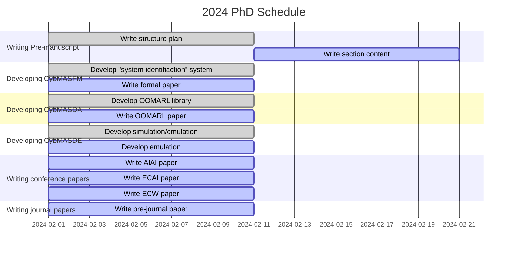

```mermaid
gantt
    dateFormat  YYYY/MM/DD
    title       2024 PhD Schedule
    %% (`excludes` accepts specific dates in YYYY-MM-DD format, days of the week ("sunday") or "weekends", but not the word "weekdays".)

    section Writing Pre-manuscript
    Write structure plan                        :done, wsp, 2024-02-01, 10d
    Write section content                       :active, wsc, after wsp, 10d

    section Developing CybMASFM
    Develop "system identifiaction" system      :done, wsp, 2024-02-01, 10d
    Write formal paper                          :active, wsp, 2024-02-01, 10d

    section Developing CybMASDA
    Develop OOMARL library                      :done, wsp, 2024-02-01, 10d
    Write OOMARL paper                         :active, wsp, 2024-02-01, 10d

    section Developing CybMASDE
    Develop simulation/emulation                :done, wsp, 2024-02-01, 10d
    Develop emulation                           :active, wsp, 2024-02-01, 10d

    section Writing conference papers
    Write AIAI paper                            :active, wap, 2024-02-01, 10d
    Write ECAI paper                            :active, wep, 2024-02-01, 10d
    Write ECW paper                             :active, wcp, 2024-02-01, 10d

    section Writing journal papers
    Write pre-journal paper                     :active, wap, 2024-02-01, 10d

```
